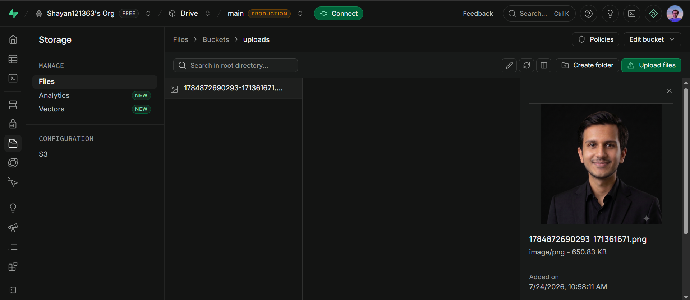

<div align="center">

# ☁️ Drive - Cloud File Storage App

### Secure Cloud Storage Platform built with Node.js, Express, MongoDB & Supabase


**A modern cloud storage application where users can register, login, and upload files securely to Supabase Storage.**

</div>

---

# 📖 Overview

Drive is a full-stack cloud file storage application that provides secure authentication and cloud-based file management. Users can create an account, log in, upload files, and store them securely using **Supabase Storage**, while user information is managed with **MongoDB**.

---

# ✨ Features

✅ Secure User Authentication (JWT)

✅ Register & Login System

✅ Password Hashing with bcrypt

✅ Upload Files to Supabase Storage

✅ Modern Responsive UI

✅ MongoDB Database Integration

✅ Server-side Form Validation

✅ Cookie-based Authentication

---

# 🛠️ Tech Stack

| Category | Technologies |
|-----------|--------------|
| **Backend** | Node.js, Express.js |
| **Database** | MongoDB, Mongoose |
| **Storage** | Supabase Storage |
| **Authentication** | JWT, bcrypt |
| **Templating** | EJS |
| **Styling** | Tailwind CSS, Flowbite |
| **File Upload** | Multer |
| **Validation** | express-validator |

---

# 📸 Screenshots


## Upload File
# 📸  Preview

<p align="center">
  
</p>

# 🚀 Installation

## 1️⃣ Clone Repository

```bash
git clone https://github.com/yourusername/Drive---Cloud-File-Storage-App.git

cd Drive---Cloud-File-Storage-App
```

---

## 2️⃣ Install Dependencies

```bash
npm install
```

---

## 3️⃣ Create Environment Variables

Create a `.env` file.

```env
MONGO_URI=

JWT_SECRET=

SUPABASE_URL=

SUPABASE_KEY=

SUPABASE_BUCKET=

PORT=3000
```

---

## 4️⃣ Run the Project

```bash
npm start
```

or

```bash
nodemon app.js
```

Open

```
http://localhost:3000
```

---

# 📂 Project Structure

```
Drive/
│
├── config/
│   ├── db.js
│   ├── multer.config.js
│   └── supabase.config.js
│
├── models/
│   └── user.model.js
│
├── routes/
│   ├── index.routes.js
│   └── user.routes.js
│
├── uploads/
│
├── views/
│   ├── home.ejs
│   ├── login.ejs
│   └── register.ejs
│
├── .env
├── .gitignore
├── app.js
├── package.json
└── README.md
```

---

# 🔑 Environment Variables

| Variable | Description |
|----------|-------------|
| MONGO_URI | MongoDB Connection String |
| JWT_SECRET | Secret key for JWT |
| SUPABASE_URL | Supabase Project URL |
| SUPABASE_KEY | Supabase Service Role Key |
| SUPABASE_BUCKET | Storage Bucket Name |
| PORT | Server Port |

---

# 🌐 Routes

| Method | Endpoint | Description |
|---------|----------|-------------|
| GET | `/` | Home |
| GET | `/user/register` | Register Page |
| POST | `/user/register` | Register User |
| GET | `/user/login` | Login Page |
| POST | `/user/login` | Login User |
| GET | `/home` | Dashboard |
| POST | `/upload` | Upload File |

---

# 📦 Packages Used

```txt
express
mongoose
multer
bcrypt
jsonwebtoken
cookie-parser
dotenv
express-validator
ejs
@supabase/supabase-js
```

---

# 🔒 Authentication Flow

```text
User
   │
   ▼
Register/Login
   │
   ▼
JWT Generated
   │
   ▼
Stored in Cookie
   │
   ▼
Authenticated Routes
   │
   ▼
Upload Files
   │
   ▼
Supabase Storage
```

---

# 💡 Future Improvements

- 📁 Multiple File Upload
- 🗂️ Folder Support
- ⭐ Favorite Files
- 🗑️ Trash Bin
- 🔍 Search Files
- 📊 Storage Usage Analytics
- 👤 User Profile
- 🌙 Dark Mode
- 📱 Mobile Friendly UI

---

# 🤝 Contributing

Contributions are always welcome!

1. Fork the repository
2. Create your feature branch

```bash
git checkout -b feature/new-feature
```

3. Commit your changes

```bash
git commit -m "Added new feature"
```

4. Push

```bash
git push origin feature/new-feature
```

5. Open a Pull Request

---

# 📜 License

This project is licensed under the **ISC License**.

---

<div align="center">

## 👨‍💻 Author

### **Shayan Ahmed**

Full Stack Developer • MERN • AI/ML Enthusiast

Made with ❤️ using Node.js, Express, MongoDB & Supabase

⭐ If you like this project, don't forget to star the repository!

</div>